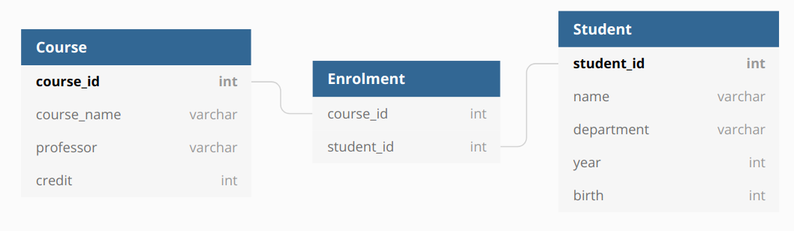

# GraphQL

<p align="center"></p>

## GraphQL이란


[GraphQL 공식문서](https://graphql.org/)에서는 GraphQL을 다음과 같이 정의합니다.

`A query language for your API`

**API를 위한 쿼리 언어이며 기존 데이터를 쿼리로 처리할 수 있는 런타임** 이 *GraphQL* 입니다.

GraphQL을 전혀 모르고 처음보는 사람이 과연 이 설명을 이해 할 수 있을까 싶습니다.

간단히 설명하자면 GraphQL도 기본적으로 HTTP 요청의 한 형태로 HTTP 위에서 동작합니다. HTTP 요청을 좀 더 쓰기 편하도록 클라이언트의 UX 친화적인 추상화를 한 것이 GraphQL이라고도 있습니다. 단적인 예로 GraphQL에서는 HTTP의 GET, POST, PUT, DELETE, OPTIONS와 같은 메서드가 없습니다.  값을 가져오는 `Query` 와 값을 변경하는 `Mutation` 두 가지로만 동작합니다.

GraphQL의 장점은 다음과 같습니다.

1. API의 데이터에 대한 complete하고 이해하기 쉬운 명세서가 제공됩니다.
2. 클라이언트는 정확히 필요한 요소만을 요구할 수 있습니다.
3. 시간이 지남에 따라 API를 발전시키기 쉽습니다.
4. 강력한 개발자 도구가 제공됩니다.

GraphQL은 Facebook에 의해 2015년 릴리스 되었으며 Facebook, Medium, Twitter, Microsoft, Github 등 많은 기업에서 도입하고 있는 기술 중 하나입니다.

<br>

## GraphQL 특징

---

### 1. 정확히 필요한 것만을 요청(over-fetching 방지)

---

RESTful API, HTTP API의 특징은 단일 end-point에 대해 단일 리소스가 제공된다든 점입니다. GraphQL이 나오기 전, 무리 없이 없이 사용된 이러한 방식의 API에는 큰 문제점이 있었습니다. `Under-fetching` 과 `Over-fetching` 이 바로 그것입니다.

<br>

Under-fetching과 Over-fetching에 대해 REST API에서 일어나는 예시를 통해 설명해 보겠습니다.

예제는 많은 데이터베이스의 예시가 그러하듯 아래와 같은 학사관리 DB를 예로 진행해 보겠습니다.

<p align="center"></p>

여기서 이 데이터 베이스의 정보를 서빙하는 REST API가 있다고 가정해 보겠습니다.

<br>

#### Over fetching

예시로 자료구조 수업을 듣는 학생의 이름 목록을 가져 오고 싶다고 가정해보겠습니다.

일반적인 REST API에서는 3 테이블을 조인 후 필터링 한 목록을 반환하게 됩니다. 하지만 우리는 지금은 학생 이름만 궁금한데 쓰지도 않을 교수이름, 학번, 학과, 학점 등까지 다 가져오게 되니다. 네트워크 적 측면에서도 낭비가 심합니다. 이런 현상을 *over-fetching* 이라 합니다.

<br>

이러한 over fetching을 막기 위해 GraphQL은 다음과 같이 처리하여 정확히 내가 필요에 의해 요청한 값만 가져올 수 있습니다.

`Request`

```graphql
query{
    enroll_student(course_name: "자료구조"){
    	student{
    		name
    	}
    }
}
```

`Response`

```json
{
    "data":{
        "enroll_student":{
            "student": [
                {"name" : "Johnie"},
                {"name" : "Sophia"},
                {"name" : "Aykut"}
            ]
		}
    }
}
```

<br>

### 2. 한번에 여러 정보 요청(under-fetching 방지)

---

위에서 사용한 예제를 그대로 활용해서 진행하여 이번에는 under fetching에 대해 알아보겠습니다.

<br>

#### Under fetching

이번에는 특정상황에서 강의 전체 목록과 학생 전체 목록이 동시에 조회하고 싶다면 어떻게 해야 할까요?

REST api에서는 강의 목록 조회와 학생 목록 조회 2번의 요청이 필요하게 될 것입니다. 이렇게 내가 필요한 정보를 단일 api가 충족시키지 못해 여러 번 요청해야 하는 것을 *under-fetching* 이라 합니다. under fetching이 왜 안좋은지 모르시는 분들은 HTTP의 동작방식에 대해 공부해 보시면 됩니다.

<br>

반면 GraphQL은 여러 리소스를 가져오기 위해서 단 한번의 요청으로 처리할 수 있습니다. 즉, under fetching을 막을 수 있습니다. 처리 방법에 대한 예시는 아래와 같습니다.

<br>

`Request`

```graphql
query{
	enroll_student(course_name: "자료구조"){
		student{
			name
		}
	}
	course{
		course_name
	}
}
```

`Response`

```json
{
    "data":{
        "enroll_student":{
            "student": [
                {"name" : "Johnie"},
                {"name" : "Sophia"},
                {"name" : "Aykut"}
            ]
        },
        "course":[
            {"course_name" : "자료구조"},
            {"course_name" : "컴퓨터 네트워크"},
            {"course_name" : "운영체제"}
        ]
    }
}
```

<br>

### 3. 단일 End-point

---

REST API의 경우 요청이 URI + HTTP 메서드 등의 조합을 통해 다양한 end point가 존재합니다.

> ex) 학생 정보 조회 :  `GET /students` 

하지만 GraphQL은 end point가 단 하나밖에 없습니다. (일반적으로 `/graphql` )

단 하나의 end point만 존재하는 대신 type을 통해 리소스를 구분할 수 있습니다. GraphQL은 type을 통해 앱이 가능한 것만 요청할 수 있도록 하고 명백하고 유용한 에러를 제공합니다.

위의 학사행정 시스템 예를 type으로 나타내면 다음과 같이 나타 낼 수 있습니다.

<br>

```graphql
type Query {
	course: [Coure]
	student: [Student]
	enroll_student(course_name: String): [EnrollStudent]
}

type Course {
	course_id: Int
	course_name: String
	professor: String
	credit: Int
}

type Student {
	student_id: Int
	name: String
	department: String
	year: Int
	birth: Int
}

type EnrollStudent {
	course: [Course]
	student: [Student]
}
```

<br>

간단히 설명을 더하자면 기본적으로 클라이언트는 Query 타입에 명세된 타입을 모두 요청할 수 있습니다.

타입은 상호간에 참조가 가능합니다. Query의 course, student, enroll_student가 하위 타입들을 참조하고 enroll_student는 course와 student를 참조하는 것이 그 예입니다.

GraphQL의 유용한 점은 하나의 end point에 대해 단 이 4개의 쿼리로 수백개 이상의 조합에 달하는 REST api의 엔드포인트를 모두 대체할 수 있다는 것입니다.

<br>

### 4. 자동화된 API 문서

---

개발한 API에 어떤 쿼리를 요청할 수 있고 어떤 데이터를 받을 수 있는지에 대해 매우 간편하게 살펴 볼 수 있습니다.

아래 예시의 GraphiQL 혹은 playground를 통해 type의 명세를 확인하고 어떤 query, 혹은 mutation의 요청이 가능한지 한눈에 파악할 수 있습니다. 또 직접 API 호출을 통해 응답 데이터까지 아주 손쉽게 확인이 가능합니다.

API 명세서를 만들기 위해 별도의 매우 귀찮고 번거롭고 힘든 작업이 필요한 REST api에 비하면 모듈 하나만 불러와서 이런게 가능하다는건 엄청난 혁신이죠.

<video style="width: 70vw; height: auto;" autoplay loop playsinline>
    <source src="./graphiql.mp4?x" type="video/mp4">
</video>


<br>

### 5. 버전 없이 API 진화시키기

---

GraphQL에서는 기존의 쿼리에 영향을 주지 않고 새로운 필드나 type을 추가할 수 있습니다.
Aging 필드는 deprecated 시키거나 tool에서 숨길 수 있습니다.

GraphQL API는 진화하는 단일 버전을 사용함으로써 앱이 지속적으로 새로운 기능에 접근하게 할 수 있습니다. 또 서버코드를 더 깨끗하고 유지보수에 용이하도록 지원합니다.

<br>


> #### Reference
>
> - [GraphQL 공식문서](https://graphql.org/)
> - [GraphQL Wikipedia](https://en.wikipedia.org/wiki/GraphQL)
> - [Who uses GraphQL?](https://stackshare.io/graphql)
> - [What is GraphQL?](https://valianttechnosoft.com/blog/what-is-graphql-it-better-than-rest/)
> - [무료 ERD 툴](https://dbdiagram.io/d)
> - [GraphQL 개념 잡기](https://tech.kakao.com/2019/08/01/graphql-basic/)
