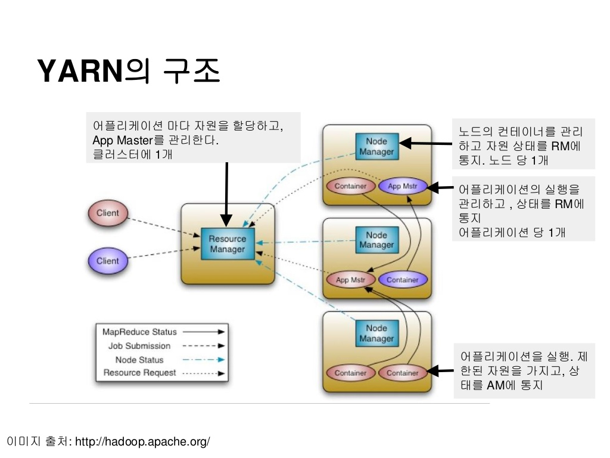

 

 

# Hadoop의 패키지 3 - YARN

## Hadoop의 리소스 매니저

 

YARN은 Hadoop 2.x버전 부터 Hadoop 패키지에 포함된 `클러스터 리소스 매니지먼트` 입니다.  좀 더 쉬운 말로 해보겠습니다. 먼저 Hadoop이 데이터 분산처리 프레임 워크입니다. 대용량 데이터를 분산데이터로 만들어 처리하는 매커니즘이 바로 Hadoop의 기본입니다. 그렇다면 데이터를 분산시킨 다음은 뭘 해야할까요? 하둡의 진가는 분산된 데이터를 여러 노드(컴퓨터)로 분산시켜 하나의 컴퓨터에서 하기 힘든 굉장히 큰 작업을 여러 컴퓨터에서 수행하되 하나의 컴퓨터에서 수행하는것처럼 동작하겠다 입니다. 여기서 이 여러 컴퓨터를 하나의 컴퓨터처럼 보이게 묶어주는 역할을 바로 YARN이 담당합니다. 

하지만 클러스터 매니저에는 YARN만 있는 것은 아닙니다. 최근 빅데이터 처리는 Spark이 대부분 장악하고 있는데 Spark을 위한 클러스터 매니저는 YARN 뿐만 아니라 Spark 내장 클러스터인 Standalone과 YARN 이전의 Apache MESOS도 있습니다. 사실 오늘날에는 이런 직접 구축한 클러스터 매니저보다 클라우드가 대체하고 있습니다. 클러스터를 구축한다는 것은 비용적으로도 관리적으로도 부담감이 큰 것은 사실이니까요. 대용량 데이터 처리를 위해서는 자원 자체는 많으면 많을수록 좋으므로 scale out이 손쉽게 가능하다는 점이 클라우드의 큰 매력이기도 합니다. 클라우드 클러스터 매니저로의 대표적인 예는 AWS의 ERM이 있습니다. 

 

## YARN의 시스템 구성

YARN의 핵심 구성 요소는 ResourceManager와 NodeManager로 나눠집니다.

 

### Resource Manager

Resource Manager은 YARN 클러스터의 Master 서버로 하나 또는 이중화를 위해 두개의 서버에서만 실행됩니다. 
Resource Manager은 클러스터 전체 리소스에 대한 관리자로, YARN 클러스터의 리소스를 다른 특정 플랫폼으로부터 요청을 받아 리소스를 할당해주는 역할입니다.

 

### Node Manager

Node Manager은 YARN 클러스터의 Worker 서버로 ResourceManager를 제외한 모든 서버에 실행됩니다.
Node Magager의 주된 역할은 사용자가 요청한 프로그램을 실행하기 위한 Container를 fork 시키고 Container를 모니터링하며 Container 장애 상황 또는 Container가 요청한 리소스보다 많이 사용하고 있는지 감시하는 것입니다. 만약 요청한 리소스보다 많이 사용하면 해당 Container를 kill 시킵니다.

 

이 두 종류의 서버는 외부로의 특별한 요청이 없으면 아무런 동작도 수행하지 않으며 NodeManager는 자신의 상태만 계속해서 ResourceManager로 보내고 ResourceManager 는 클러스터의 전체 리소스 상황에 대한 현황 관리만 수행합니다. 즉, YARN 자체만으로는 할 수 있는 것이 아무것도 없고 이는 곧 아무것도 하지 않을 때도 유지해야 한다는,  관리의 비용이 증가한다는 단점이 있습니다. YARN을 도구로서 사용될때 그 의미가 생기게 되는 것입니다. 이런 YARN을 사용하는 주체가 되는 것들이 MapReduce나 Spark 과 같은 분산 컴퓨팅 플랫폼이나 HBase 등과 같이 분산된 환경에서의 컴퓨팅 리소스(CPU, 메모리 등)가 필요한 클러스터 기반 시스템 들입니다.

 

## YARN을 이용한 클러스터 자원 공유

이제 YARN을 통해 리소스가 어떻게 분배되는 지에 대해 알아보겠습니다.

예를 들어 100대의 서버에 하나의 MapReduce 작업이 실행되고 있는 중에 Spark 작업 요청이 들어 왔습니다. YARN 이 없는 상황이라면 MapReduce 를 위한 서버 50대의 별도 클러스터를 구성하고, 50대에 Spark 클러스터를 구성해 놓을 수 있습니다. 또는 100대 모두 MapReduce, Spark 클러스터를 구성할 수 있습니다. 두가지 경우 모두 문제가 될 수 있습니다.

1. 50대 씩 설치한 경우 특정 시점에 MapReduce 작업만 수행되고 Spark 작업이 수행되지 않으면 50대의 자원은 낭비되게 됩니다. 매일 100만원씩 리셋되는 통장이 있는데 50만원만 쓰면 굉장히 아깝겠죠?
2. 100대에  MapReduce, Spark 모두 설치한 경우 각 클러스터가 메모리를 모두 사용하도록 구성되면 두 작업이 동시에 수행되면 작업은 Fail이 됩니다. 리소스는 한정된 자원이니까요. 반면 각 서버의 메모리를 50%씩 나누어 쓰게 구성하면 MapReduce 작업만 수행되거나 Spark 작업만 수행되는 경우 1번의 예와 같은 자원의 낭비가 일어납니다.

YARN이 각광받게 된 가장 큰 이유가 자원이 낭비되지 않고 그때그때 최대한 자원을 끌어쓸 수 있도록 스케쥴링을 통한 자원 동적 분배에 있습니다. 이러한 장점은 다음과 같은 시나리오를 가능하게 합니다.

1. 100대에 YARN 만 설치했다고 가정하겠습니다.
2. MapReduce 작업 실행 시점에 100대의 서버에서 각 서버의 모든 자원을 활용하여 작업을 실행합니다.
3. 이 상태에서 Spark 작업을 실행하면 YARN은 50대의 서버에서 실행되던 MapReduce Task를 강제 종료시키고 Spark에 작업에 리소스를 할당해주게 됩니다.

해당 예제는 쉬운 이해를 위한 시나리오로 실제 환경은 더 복잡합니다. 이렇게 동작하면 서로 다른 컴퓨팅 플랫폼에서 작업하는 작업들이 하나의 리소스 관리자에 의해 관리됨으로써 서버 리소스 낭비를 최소화할 수 있습니다. 이것이 YARN을 만든 목적이고 YARN의 최대 장점입니다.

이렇게 Resource를 유연하게 할당할 수 있도록 하는 기능이 YARN의 스케줄러인데 FIFO, Capacity, Fair 스케줄러를 제공하며 기본은 FIFO 입니다. FIFO를 사용할 경우 위와 같은 시나리오는 제한적으로 얻을 수 있습니다. 위와 같은 시나리오를 얻기 위해서는 Capacity, Fair를 사용하시면 됩니다.

  

> Reference
>
> - [HADOOP ARCHITECTURE -YARN](https://nub8.net/hadoop-architecture-yarn/)
> - [What is hadoop yarn](https://www.popit.kr/what-is-hadoop-yarn/)
> - [SlideShare-YARN](https://www.slideshare.net/madvirus/2-yarn)
> - [what-is-a-container-in-yarn](https://stackoverflow.com/questions/14365218/what-is-a-container-in-yarn)