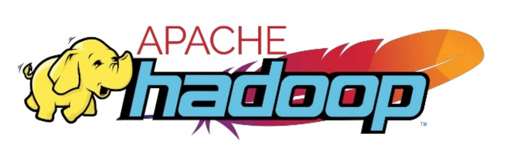

 

# Hadoop 이란

 

Hadoop은 2006년 세상에 처음 나오게 됐습니다.

Hadoop의 기반에는 구글의 두 논문 GFS(Google File System)와 프로그래밍 모델 MapReduce 가 있습니다.

기존의 RDB 기술로는 대용량 비정형 데이터의 처리가 힘들었기 때문에 위의 두 논문을 바탕으로 제작된 Java 기반 대용량 데이터 분산 처리 프레임워크가 Hadoop 입니다.

Hadoop에는 많은 Eco system이 존재하는데 현재는 하둡 본연의 기술보다는 이 Eco System이 더 인기가 많습니다. 그렇기에 전통적인 의미의 Hadoop은 빅데이터 처리 프레임워크였다면 오늘날의 의미는 대용량 데이터처리를 위한 모든 System에 더 가깝습니다.

여담으로 Hadoop이란 이름과 심볼이 코끼리가 된 계기는 굉장히 뜬금 없습니다. 창시자인  Doug Cutting의 딸이 가지고 놀던 코끼리 인형의 이름이 `Hadoop` 이었습니다. 이런 네이밍 센스 덕분인지 현재 Hadoop Eco System에 있는 대부분의 기술의 이름은 동물과 관련이 있습니다. 또 Hortonworks 라는 회사를 Doug Cutting이 세웠는데 이 회사의 마크도 코끼리입니다.

  

> #### Reference
>
> - [Apache Hadoop](https://hadoop.apache.org/)
>
> - [하둡이란?](https://wikidocs.net/22654)
> - [Apache Hadoop 기반 대용량 데이터 분석 시스템 구축](https://www.oss.kr/editor/file/3bd27047/download/657f3794-165c-431c-9043-97122e52715c)

