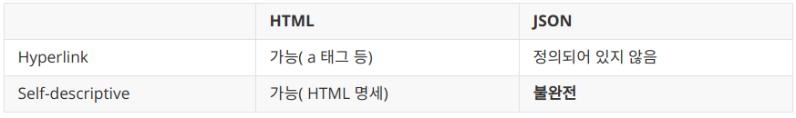

<p align="center"></p>

> [그런 REST API로 괜찮은가](https://youtu.be/RP_f5dMoHFc?t=0s) 영상을 기반으로 한 문서입니다.
>
> 이전의 [REST](../rest) 이후 내용이 이어집니다.

## RESTful API란

---

RESTful이란 말 그대로 REST 아키텍쳐 스타일을 따르는 것을 말합니다.

따라서 당연히 RESTful API는 REST  아키텍쳐 스타일을 따르는 API를 지칭하게 되는 것입니다.

REST에 대해 [이전 글](../rest) 에서 설명하며 오늘 날 RESTful API는 사실 REST하지 않고 REST는 성공이지만 REST API는 성공이라고 할 수 없다고 언급하였습니다. 

REST API가 성공이 아닌 이유는 자명하게도 REST를 지키지 못하기때문입니다. 

REST의 6가지 조건(client-server, stateless, cache, uniform interface, layered system, code on demand)를 모두 만족시켜야 비로소 RESTful API가 되므로 대부분의 REST라고 우기는 API를 실제 REST하게 하는 방법에 대해 이야기 해보겠습니다.

<br>


### 원격 API가 반드시 REST해야 하는가?

그전에 원격 API들이 반드시 REST해야 하는가에 대해 먼저 이야기 하겠습니다.

정답은 당연히 아닙니다. 실제로도 REST가 아닌데도 REST라 부르는 api들이 무수히 많은 것이 증거죠.

REST를 고안한 Roy Fielding도 이 질문에 대해 다음과 같이 대답했습니다.

*If you think you have control over the system or aren't intersted in evolability, don't waste your time arguing about REST. - Roy T. Fielding-*

멋있는 척하지만 쉽게 말하면 제대로 하고 싶으면 REST 지켜라는 말입니다.

<br>

### 왜 API는 REST가 잘 안될까(feat. web은 잘 되는데)

---

REST API가 가장 지켜지지 않는 Uniform interface의 self descriptive와 hateoas에 대해 웹과 API를 살펴보겠습니다.

웹을 구성하는 HTML과 API의 경우 JSON 혹은 XML로 메세지가 전달되는 경우가 대부분이므로 HTML과 JSON에 대해 비교해보겠습니다.

<br>

<p></p>

<br>

Hyperlink에 대해 이야기 해보면 HTML에서는 a태그와 같은 형식으로 하이퍼 링크를 표현할 수 있습니다.

제 글에도 많은 부분의 예가 있죠.

하지만 JSON의 경우는 그런거 없죠. 단순 문자열과 숫자정도 밖에 없습니다.

Self descrpitive에 대해서도 보면 HTML은 그 자체로 의미를 가지며 HTML 명세를 통해 스스로를 설명할 수 있습니다. 아주 Self descriptive 합니다.

반면 JSON은 JSON format을 통해 배열과 객체로 파싱은 할 수 있습니다. 즉 문법 해석은 가능합니다. 하지만 내부의 의미에 대해 파악하고 싶다면 별도의 문서로 남기는 방법밖에 없습니다. 따라서 self descriptive가 불완전 하다고 할 수 있습니다.

<br>

### REST하지 않은 API를 REST로 고치기

---

REST에 대해 제대로 알게 됐으니 이제 REST라고 우기지 말고 실제 REST할 수 있게 되는 방법에 대해 소개해보겠습니다.

<br>

#### JSON을 Self-descriptive하게 만들기

*방법 1: Media type*

```http
GET /todos HTTP/1.1
Host: example.org
```

```http
HTTP/1.1 200 OK
Content-Type: application/vnd.todos+json
[
	{"id": 1, "title": "hello"},
	{"id": 2, "title": "world"}
]
```

1. 먼저 미디어 타입을 하나 정의합니다.
2. 다음 미디어 타입의 문서를 작성합니다. 여기서는 JSON의 key들이 의미하는 것들을 정의합니다.
3. IANA에 미디어 타입을 등록하고, 이때 만든 문서를 미디어 타입의 명세로 등록하면 됩니다.

이 방법의 단점은 딱 들어도 보이듯 굉장히 번거롭고 귀찮고 복잡하며 우리를 힘들게 만듭니다. 

<br>

*방법 2 : Profile*

```http
GET /todos HTTP/1.1
Host: example.org
```

```http
HTTP/1.1 200 OK
Content-Type: application/json
Link: <https://example.org/docs/todos>; rel="profile"
[
	{"id": 1, "title": "hello"},
	{"id": 2, "title": "world"}
]
```

1. 마찬가지로 JSON의 key들이 의미하는 것을 정의한 명세를 작성합니다.
2. Link 헤더에 profile relation으로 해당 명세를 링크합니다.
3. 이제 메시지를 보는 사람은 명세를 찾아갈 수 있으므로 문서의 의미를 온전히 해석 가능하게 됩니다.

<br>

이전보다는 약간은 간단(?) 해졌습니다. 하지만 이로 인해 나타나는 문제점은 다음과 같습니다.

1.  클라이언트가 Link헤더(RFC 5988)와 profile(RFC 6906)을 이해해야 합니다.
2.  content negotiation을 할 수 없습니다.
    - 클라이언트가 해당 타입을 지원하지 않는 경우 서버가 알 수 없는 것을 말합니다.

<br>

#### JSON을 HATEOAS로 만들기

*방법 1 : data에 표현*

```http
GET /todos HTTP/1.1
Host: example.org
```

```http
HTTP/1.1 200 OK
Content-Type: application/json
Link: <https://example.org/docs/todos>; rel="profile"
[
	{"link": "https://~~~", "title": "hello"},
	{"link": "https://***", "title": "world"}
]
```

data에 대양한 방법으로 하이퍼링크를 표현할 수 있습니다.(직접 링크를 표현하는 등)

이때 생기는 문제는 링크를 표현하는 방법을 직접 정의해야 합니다.(media type, profile 등의 방법)

<br>

*방법 2 : HTTP 헤더*

Link, Location 등의 헤더로 링크를 표현하는 방법입니다.

```http
HTTP/1.1 200 OK
Content-Type: application/json
Link: 	</articles/1>; rel="previous",
	</articles/3>; rel="next"
{
	"title": "The second article",
	"contents": "blah blah..."
}
```

<br>


hateoas의 경우 data, 헤더 모두 활용할 수 있고 이 방법이 더 좋다고 합니다.

<br>


### 추가적으로...

---

- hyperlink는 반드시 온전한 형식의 uri여야 하는가? 하면 그렇지 않습니다. 경로만 나타내거나 uri template(/user/{userId}) 도 가능합니다.

- Media type 등록... 정말 힘들어 보이는데 필수인가? Roy Fielding에 의하면 읽는 사람이 누구나 **절대 오해없이** 식별 가능하면 필요 없다고 합니다. **절대 오해 없이**가 핵심입니다. 이전에 언급한 api는 반드시 REST해야하는가에 대한 답변과 같은 맥락이라고 볼 수도 있겠습니다.

- 마지막으로 한번 더 강조해 보자면 REST는 긴 시간에 걸쳐 진화하는 웹 애플리케이션을 위한 것입니다. 따라서 절대 쉽지 않다는 트레이드 오프가 따르게 되는 것입니다.

<br><br>


> #### Reference
>
> [그런 REST API로 괜찮은가](https://youtu.be/RP_f5dMoHFc?t=0s)
>
> [Understanding REST](https://medium.com/@sagar.mane006/understanding-rest-representational-state-transfer-85256b9424aa)