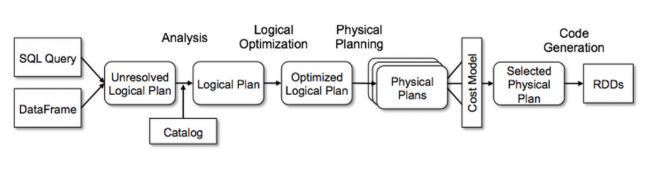
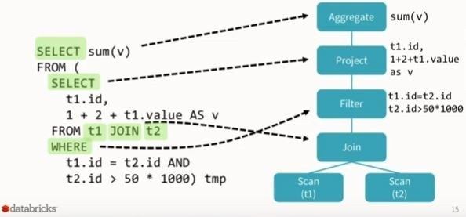
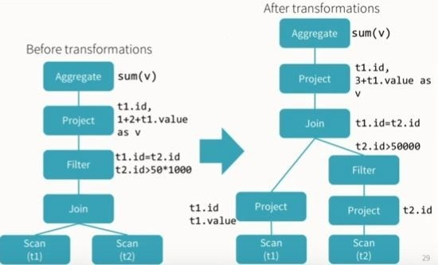
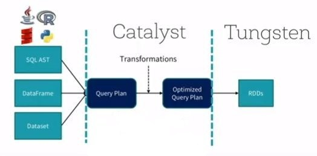
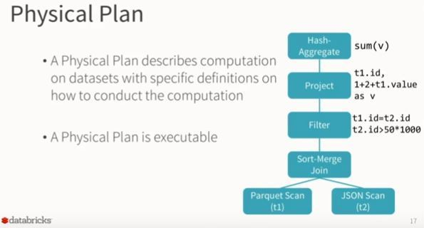
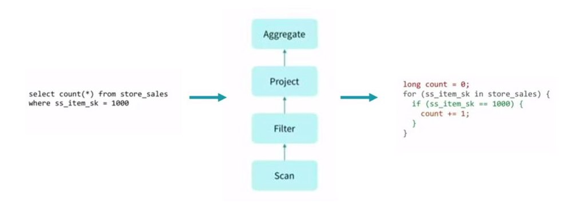

> [Understanding Spark’s Logical and Physical Plan in layman’s term](https://blog.knoldus.com/understanding-sparks-logical-and-physical-plan-in-laymans-term/) 기반 자료입니다.

# Spark의 동작 단계

> Apache Spark 2.x 기준 DataFrame, Spark SQL을 기준으로 한 동작과정입니다. 
>
> 현재 이 글만으로는 이해하기가 어려울 수도 있습니다. Spark의 흐름을 파악하고 직접 경험해보고 나면 좀더 쉽게 이해가 가능합니다.

Spark의 동작은 크게 3단계로 나눠집니다.

1. Business logic

   - Spark를 이용해 작성한 코드를 의미합니다.
   - 코드에 문제가 없다면 Spark이 코드를 Logical plan으로 변형합니다.

2. Logical plan

   - 수행해야하는 모든 변환 단계에 대한 추상화입니다.
   - Catalyst Optimizer을 거치며 이 단계에서 우리가 표현한 것에 대한 최적화과정도 진행됩니다.
   - 일반적인 RDBMS에서의 Query plan과도 유사한 역할입니다.

3. Physical plan

   - 단순히 Logical plan이 어떻게 클러스터에서 실행될 지에 대해 정의합니다.
   - 따라서 가장 핵심적인 최적화 과정이 수행됩니다.

전반적인 프로세스를 그림으로 나타내면 다음과 같습니다.

{: width="90%"}

이제 Logical & Physical plan에 대해 더 자세히 알아보겠습니다.


## Logical Plan

실행할 수 있는 코드가 있을때, 첫 단계는 Logical plan을 만드는 것입니다.

Logical plan은 3단계로 나눠집니다.

1. Unresolved Logical Plan 혹은 Parsed Logical Plan
2. Resolved Logical Plan 혹은 Analyzed Logical Plan 혹은 Logical Plan
3. Optimized Logical Plan

일단 들어가기에 앞서 Logical plan이 정확하게 뭘까요?

Logical plan은 수행해야하는 모든 transformation 단계에 대한 추상화이며 드라이버(Master node)와 Executer(Worker node)에 대해서는 다루지 않습니다. 쉽게 말하면 데이터가 어떻게 변해야 한다는것을 명시하고 저장하지만, 실제 어디서 동작하는지에 대해서는 미지수라는 의미입니다. SparkContext가 Logical plan을 생성하고 저장하는 주체입니다. 이런것이 user expression을 optimized version으로 바꿔주는 것입니다.

다음은 다음과 같은 코드를 쓴다고 가정해보겠습니다.

```scala
val file = spark.sparkContext.textFile("...")
```

SparkContext는 이 코드를 Spark이 이해할수 있도록 내부적인 표현법으로 변환하려 할 것입니다.

하지만 그전에 첫번째 단계는 `Unresolved Logical Plan`을 생성하는 것입니다.

코드와 syntax에 문제가 없더라도 컬럼 이름 혹은 테이블 이름이 잘못되었거나 없는 것일수도 있습니다. 이것이 Unresolved logical plan이라는 이름이 붙고 생긴 이유입니다.

기본적으로 여기서 일어나는 것은 우리가 잘못된 컬럼 이름을 사용했을때도 Unresolved logical plan이 일단은 생성됩니다. 이렇게 Spark이 컬럼 이름, 테이블 이름 검사하지 않고 빈 Loical plan을 만드는것이 첫단계입니다.

또 Spark은 Spark의 모든 정보(테이블, DataFrame, DataSet)를 저장하는 저장소인 `Catalog` 라고 하는 컴포넌트를 사용합니다. meta-store에서 가져온 데이터가 모두 Catalog로 들어갑니다. Spark에는 Catalog에서 cross-checking을 통해 semantic, 컬럼 이름, 테이블 이름을 확인 / 검증하기 위한 `Analyzer`라는 컴포넌트도 있습니다. 이렇기 때문에 DataFrame/DataSet에서는 Logical plan에서 Action이 일어나기 전 어느정도 분석이 일어나기 때문에 semi-lazy evalution을 따른다고도 합니다.

```scala
dataFrame.select("age") // Column "age" may not exists
```

만약 Analyzer가 테이블 명, 컬럼 명 등을 해결(resolve)하지 못한다면, Analyzer은 Unresolved Logical plan을 reject하게 됩니다. 반면 해결된다면 `Resolved Logical Plan`을 생성하게 됩니다.

{: width="70%"}

> SQL to Resolved Logical Plan

Resolved Logical Plan이 생기고 나면 `Catalyst Optimizer`을 통과하게 됩니다. Catalyst Optimizer은  자체적인 규칙을 적용하고 plan을 최적화하는, logical plan의 최적화를 수행합니다. 다음은 Catalyst Optimizer의 역할의 예입니다.

1. 모든 태스크가 수행가능하며 특정 단계에서 하나로 계산(compute)될수 있는지에 대한 확인
2. multi join query에서 퍼포먼스 최적화를 위한 쿼리 실행순서 결정
3. project 이전에 filter을 평가함으로써 쿼리 최적화

이것을 통해 Optimized Logical Plan이 생성됩니다.

{: width="70%"}

> Resolved to Optimized Logical Plan

{: width="70%"}

> Catalyst Optimizer

Catalyst Optimizer 은 커스텀된 최적화를 위해 특정 규칙을 정의 / 적용하여 비즈니스 유스케이스에 따라 직접 만들수도 있습니다.

<br>

## Physical Plan

이제 Spark 내부 최적화 과정인 Physical Plan에 대해 이야기해보겠습니다. Optimizer Logical plan이 생기고 나면 Physical Plan이 생성됩니다.

들어가기에 앞서 Physical Plan의 정확한 역할은 뭘까요?

간단하게 얘기하면 우리의 Logical plan이 어떻게 클러스터 위에서 실행될지에 관한 것입니다. 다양한 종류의 실행 전략을 만들고 `Cost Model`에서 계속 비교합니다. 예를 들어 각 전략에서의 실행 시간과 리소스 사용량을 추정하여 best opitimal one이 될 전략을 `Best Physical Plan` 혹은 `Selected Physical Plan`으로 선정합니다.

<br>

### Physical plan에서는 어떤 일이 일어날까?

 두 테이블을 조인하는 쿼리를 수행하는것을 예로 들어보겠습니다. 조인을 위한 테이블이 하나의 fat table과 하나의thin table 이며, 두 테이블은 다른 수의 partition을 가지고 클러스터 내에서 다른 노드에 있다고 가정해보겠습니다. Spark은 최적화를 위해 어떤 파티션이 먼저 조인될지, 어떤 타입의 조인을 할지 등에 대해 결정해야 합니다. 조인의 순서는 기본적으로는 조인되는 파티션의 순으로 진행됩니다. 

Physical plan은 Spark operation에만 적용되며, 이를 위해 여러 Physical plan을 체크하며 best optimal physical plan을 결정합니다. 결정된 plan이 최종적으로 클러스터 위에서 동작하게 됩니다.

{: width="70%"}

> Optimized Logical Plan to Physical Plan

Best Physical Plan이 선택되고 나면, 분산환경에서 클러스터에 실행될 쿼리를 위한 실행가능한 코드(DAG of RDDs)를 생성하는 차례입니다. 이 프로세스를 `Codegen`이라 하며 Spark의 **Tungsten** 실행엔진의 역할입니다.

{: width="80%"}


<br>

### 정리하며

Logical Plan은 특정 테이블에 join, filter, where, groupBy 등과 같은 일련의 변환을 적용한 후 출력으로 예상되는 내용을 보여줍니다.

Physical Plan은 조인 유형, 필터 실행 순서, where, groupBy 절 등을 결정합니다.

이것이 SPARK SQL이 내부적으로 작동하는 방식입니다.

또 여기서 볼 수 있는 것은, Spark에서 집중해야 할 것은 Spark은 분석 엔진이라는 것입니다. Spark은 단일 엔진으로서의 역할에만 충실합니다. 따라서 로컬머신에서 한대의 CPU로 충분히 활용할 수도 있습니다. 위 단계의 physical plan & logical plan은 분산환경이 아니여도 전혀 상관이 없습니다. 중요한 것은 오로지 `immutable` & `idempotent`만 고려하는 작업들입니다.

<br>

<br>

>#### Reference
>
>[Understanding Spark’s Logical and Physical Plan in layman’s term](https://blog.knoldus.com/understanding-sparks-logical-and-physical-plan-in-laymans-term/)~~~~~~~~~~~~~~~~~~~~~~~~