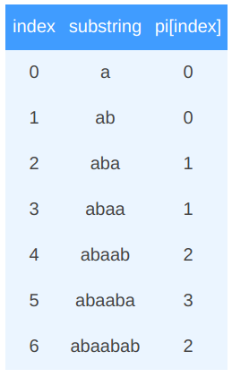
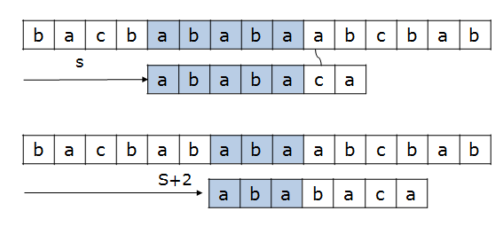

KMP의 효율성을 알기 위해서 KMP 없이 원문에서 단어 검색을 어떻게 할지 생각해보겠습니다.
원문이 "ABCABABCDE" 일 때  단어  "ABA"를 찾는 방법을 알아보겠습니다.

가장 직관적으로 봤을때 Brute force를 이용해 처음부터 한칸씩 건너가며 비교해보는 방법을 사용할 수 있습니다.

#1

| A    | B    | C    | A    | B    | A    | C    | D    | E    |
| ---- | ---- | ---- | ---- | ---- | ---- | ---- | ---- | ---- |
| A    | B    | A    |      |      |      |      |      |      |

<br>#2

| A    | B    | C    | A    | B    | A    | C    | D    | E    |
| ---- | ---- | ---- | ---- | ---- | ---- | ---- | ---- | ---- |
|      | A    | B    | A    |      |      |      |      |      |

<br>#3

| A    | B    | C    | A    | B    | A    | C    | D    | E    |
| ---- | ---- | ---- | ---- | ---- | ---- | ---- | ---- | ---- |
|      |      | A    | B    | A    |      |      |      |      |

<br>#4

| A    | B    | C    | A    | B    | A    | C    | D    | E    |
| ---- | ---- | ---- | ---- | ---- | ---- | ---- | ---- | ---- |
|      |      |      | A    | B    | A    |      |      |      |

<br>

이렇게 해도 원하는 문자열을 **찾을 수는** 있습니다. 하지만 이 경우의 최악의 경우 시간복잡도는 O(NM)으로 계산됩니다. 이때 N과 M은 각각 원문의 길이와 검색어의 길이를 의미합니다.

<br>

시간복잡도가 O(NM)이라고 하면 과연 효율 안좋은 것일까요?

여기서 M = N/2이라고 가정해보겠습니다. 이때 최악의 경우 가장 앞에서부터 쭉 탐색하다가 N/2 지점까지 와서야 결과가 나오게 되겠죠. 그렇다면 이 경우의 시간복잡도는 (N^2)/4 즉 O(N^2)가 되게 됩니다.

무작정 N^2가 안좋다고 말할수는 없습니다. 하지만 Knuth, Morris, Prett 라는 사람들이 이보다 훨씬 효율적인 문자열 검색 알고리즘을 내 놓게 됩니다.

<br>

# KMP

결과부터 말하면 KMP는 문자열 검색의 시간복잡도를 O(N+M)을 보장해주게 됩니다. 즉 일반적으로는 검색어의 길이가 더 짧으므로 원문의 길이가 N일때 O(N)시간 안에 탐색이 가능한 것입니다.

KMP의 핵심 개념은 다음과 같습니다.

검색어가 "aecaed" 일때 만약 원문에서 "aecae"까지는 일치하지만 d가 아니라 다른 문자열이 왔을 경우 마지막에 사용된 ae부터 다시 시작하면 된다는 정보를 제공해주는 것입니다.

말이 참 어렵습니다.

이것을 이해하기 위해서 먼저 `prefix`와 `suffix`에 대해 알아보겠습니다.

<br>---

## Prefix & Suffix

번역하면 접두사와 접미사죠. 여기서의 prefix와 suffix는 쉽게 말해 단어의 앞부분과 뒷부분 의미합니다.

위의 "aecaed"를 활용해 prefix와 suffix의 예를 보겠습니다.

| Prefix |      |      |      | Suffix |
| ------ | ---- | ---- | ---- | ------ |
| a      |      |      |      | d      |
| ae     |      |      |      | ed     |
| aec    |      |      |      | aed    |
| aeca   |      |      |      | caed   |
| aecae  |      |      |      | ecaed  |
| aecaed |      |      |      | aecaed |

<br>

KMP에서는 prefix와 suffix를 활용해 `pi`라는 이름의 배열을 사용합니다.

이 pi 배열에 대해 알아보겠습니다.

<br>

---

## pi 배열

pi 배열의 각 요소는 다음과 같습니다.

pi[index] = 검색어의 0~i까지 부분 문자열에서 같은 길이의 prefix와 suffix가 같은 것중 가장 긴 문자열의 길이

(이때 prefix의 길이는 i보다 작아야 한다.)

설명이 너무나도 어렵습니다. 한번에 이해했으면 천재...

계속 "aecaed"를 활용하여 예시로 살펴 보겠습니다.

{:width="50%"}

<br>

다음은 또다른 예입니다.

{:width="50%"}

<br>

다음은 pi를 만들기 위한 Java코드입니다.

```java
public int[] getPI(char[] keyword){
    int compareIndex = 0;
    int length = keyword.length;
    int[] pi = new int[length];

    for(int index = 1; index < length; index++){
        while(compareIndex > 0 && keyword[index] != keyword[compareIndex]){
            compareIndex = pi[compareIndex-1];
        }
        if(keyword[index] == keyword[compareIndex]){
            pi[index] = ++compareIndex;
        }
    }

    return pi;
};
```

getPi 함수의 코드를 보며 참 이해가 가지 않았던 부분이 있었습니다.

```java
while(compareIndex > 0 && keyword[index] != keyword[compareIndex]){
    compareIndex = pi[compareIndex-1];
}
```

이부분인데, 왜 이런 로직이 나오게 됐을까요?

제가 들었던 첫번째 의문은 왜 바로 0을 집어넣지 않을까였고 두번째 의문은 왜 while일까 였습니다.

이 의문을 해결하기 위해 2번째 예시를 살펴보겠습니다.

index가 6일때 해당 while문 속으로 들어오게 됩니다. while문으로 들어왔다는것은 새로 들어온 문자(keyword[index])가 기존의 다음문자(keyword[compareIndex])와 일치하지 않는 것이고 그렇다면 기존에 비교해 놨던 것들을 활용하여 다시 compareIndex의 시작 시점을 설정해줘야 합니다. 여기서는 3글자 3글자는 같았죠. 이 3글자 안에서 prefix와 suffix가 같은 가장 긴 문자열의 길이가 바로 pi[compareIndex-1] 입니다. -1은 인덱스는 0부터 시작하기 때문이죠.

말이 굉장히 어렵습니다. 다시 한번 말해보자면 index가 5일때는 prefix와 suffix가 일치하는 가장 긴 것이 aba입니다. 근데 조건에 맞지 않아 while문으로 들어왔고 앞에서 prefix의 prefix와 suffix의 suffix가 같은 가장 긴 문자열의 길이가 새로운 compareIndex가 되게 되는 것입니다.

그리고 이것이 제가 들었던 2가지 의문들의 해답이 된 것입니다.

<br>

이제 이 pi를 이용해 어떻게 효율적으로 탐색할 수 있는지 알아보겠습니다.

<br>

---

## pi의 활용

{:width="80%"}

pi를 활용하여 위의 그림과 같이 현재 상황에 최적화될수 있도록 불필요한 부분에서의 탐색을 건너 뛰어버릴수 있습니다.

전반적인 로직은 getPi에서와 유사합니다.

기본적으로 contextIndex(원문의 인덱스)와 keywordIndex를 1씩 증가시키며 두 문자가 일치하지 않을때는 최적의 시점으로 돌아가고 단어가 완전히 같을때는 또 해당 시점의 사이에서 일치하는 문자열이 있을수도 있으므로 다시 최적의 시점을 찾아가게 되는 알고리즘입니다.

```java
public int kmp(char[] context, char[] keyword){
    int[] pi = getPI(keyword);
    int count = 0;
    
    int keywordIndex = 0;
    int keywordLength = keyword.length;
    int contextLength = context.length;

    for(int contextIndex = 0; contextIndex < contextLength; contextIndex++){
	    while(keywordIndex > 0 && context[contextIndex] != keyword[keywordIndex]){
	            keywordIndex = pi[keywordIndex-1];
	    }
	    if(context[contextIndex] == keyword[keywordIndex]){
	        if(keywordIndex == keywordLength-1){
                count++;
	            keywordIndex = pi[keywordIndex];
	        }else{
	            keywordIndex++;
	        }
	    }
	}

	return count;
};
```


<br>

KMP는 정말 복잡한 알고리즘인것 같습니다. 반복해서 노출되지 않으면 금세 까먹게 될테고 다시 공부가 필요할 것 같네요.

<br>

<br>


> #### Reference
>
> - [kmp](https://bbc1246.blogspot.com/2016/08/kmp.html)
>
> - [KMP(Knuth–Morris–Pratt) 알고리즘](https://jason9319.tistory.com/130)
>
> - [KMP : 문자열 검색 알고리즘](https://bowbowbow.tistory.com/6)

