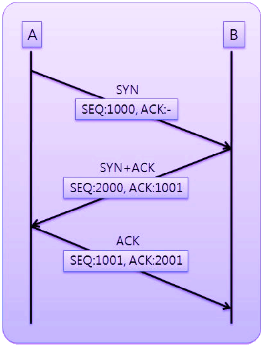
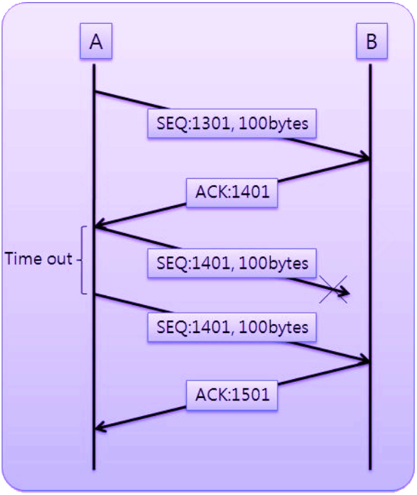
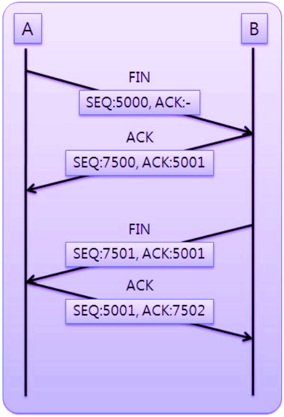

TCP기반의 소켓이 어떻게 연결되고 어떻게 신뢰성있는 통신을 제공하며 연결은 어떻게 해제되는지에 대해 알아보겠습니다.

 

## TCP의 연결 - 3way handshake

 

TCP는 장치들 사이 논리적인 접속을 구축하기 위해 three-way handshake를 사용합니다.

three-way  handshake의 전반적인 흐름은 아래 그림과 같습니다.

### Step 1(SYN)

먼저 A(Client)가 B(Server)로 연결 요청하는 패킷을 보내는데 이런 패킷을 `SYN`(Synchronize Sequence Number)이라고 합니다. SYN은 세그먼트를 시작하는 시퀀스 번호(SEQ)와 함께 클라이언트가 서버에게 통신을 시작하자고 신호로써 전달됩니다.

### Step 2(SYN+ACK)

다음은 B가 A에게 패킷을 잘 받았고, 연결 요청을 수락한다는 응답 위해 SYN-ACK signal bits set을 보냅니다. 이러한 패킷을 SYN+ACK 메세지라고도 하며 SEQ에 2000이라는 숫자를 부여하고 Step1에서 받은 SEQ+1 한 값을 ACK(Acknowledgement)에 설정합니다. 여기서 ACK는 수신한 세그먼트에 대한 응답을, SYN은 서버측에서 원하는 시퀀스 번호를 나타냅니다. 좀더 상세히 말하자면 여기서는 B는 1000번에 대한 OK로 ACK를 보내는 것이고 A에게 2000이라는 SYN을 요청하는 것입니다.

### Step 3(ACK)

마지막으로 A가 B에게 패킷을 잘 받았고,  통신을 시작해보자고 하는 패킷을 보내게 됩니다. B가 원했던 세그먼트 번호에 +1을 하여 ACK에 담아 응답합니다. 이것으로 reliable connection이 구축되게 됩니다.

 

이렇게 3번 왔다갔다 악수했다는 의미에서 three way handshake라는 이름이 붙게 되었습니다. 

 

---

 

## TCP를 이용한 데이터 통신

이제 서로 연결을 됐으니 데이터를 어떻게 주고 받는지 알아보겠습니다.

처음에 A가 B에게 데이터 패킷을 보냅니다. 이 패킷은 1301이라는 SEQ를 가졌고, 크기는 100바이트입니다. 그러면 B는 데이터를 잘 받았는지에 대해 ACK메세지로 응답합니다. ACK 메세지는 받은 패킷 번호와 받은 데이터의 크기를 합친 값으로써, 다음으로 받을 SEQ이기도 합니다. 수신된 데이터의 크기를 더하는 이유는 수신확인과 더불어 100바이트가 모두 잘 전달되었다는 지표가 될수도 있습니다.

두번째 패킷을 B로부터 받은 1401 SEQ와 함께 보냅니다. 하지만 여기서 중간에 패킷이 손실이 일어난다면 B는 A에게 응답을 줄 수 없게 됩니다. 응답이 설정된 timeout 시간이 지나도 오지 않으면 A는 패킷 손실을 인지하고 다시 같은 요청을 보내게 됩니다.  

 

---

 

## TCP 연결 해제 - 4 way handshake

통신이 끝나고 나면 연결은 해제해줘야 겠죠 그 과정을 알아보겠습니다.

A가 B에게 연결을 종료하자는 의미의 FIN 플래그와 함께 SEQ를 보냅니다. 그럼 B는 곧바로 연결을 끊는 것이 아니라 응답 ACK만 보냅니다. 이유는 B가 아직 전송해야 할 데이터가 남았다는 등의 이유로 종료할만한 상황이 아닐수도 있기 때문입니다.

B에서 종료할 상황이 되었을때, 연결이 종료되었다고 A에게 FIN 플래그를 보내게 됩니다. 그러면 A는 이에 대한 응답 ACK를 다시 보내게 되고, ACK를 받은 서버는 소켓 연결을 종료합니다.

 

이런 4단계에 걸쳐 진행되기 때문에 연결에서와 유사하게 four way handshaking이라고 합니다.

  

> #### Reference
>
> - [[TCP/IP] TCP/IP 송수신 과정](https://whenday.tistory.com/18)
> - [[ 네트워크 쉽게 이해하기 22편 ] TCP 3 Way-Handshake & 4 Way-Handshake](https://mindnet.tistory.com/entry/네트워크-쉽게-이해하기-22편-TCP-3-WayHandshake-4-WayHandshake)
> - [TCP 3-Way Handshake Process](https://www.geeksforgeeks.org/tcp-3-way-handshake-process/)
> - [What is a three-way handshake in TCP?](https://www.youtube.com/watch?v=LyDqA-dAPW4)
> - [[TCP]3-way-handshake & 4-way-handshake](https://asfirstalways.tistory.com/356)