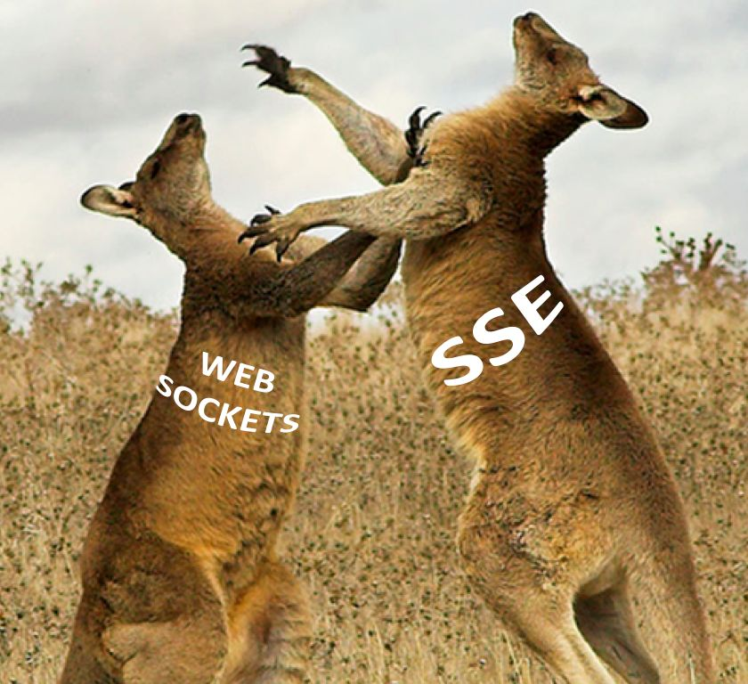

# Server-Sent Events VS WebSocket

## WebSocket

### WebSocket 이란?

- HTML5이 나오며 함께 등장한 웹소켓은 W3C와 IEFT에 의해 자리잡은 표준 프로토콜중 하나 
- transport protocol의 일종으로 서버와 클라이언트 간의 효율적인 양방향 통신이 가능
- 웹 위에서 동작하는 TCP 혹은 Socket이라고도 이해할 수 있다.

### WebSocket 특징

- 클라이언트-서버 간의 하나의 Socket Connection을 유지해서 언제든 자유롭게 양방향 통신 가능
- 채팅, 게임, 주식 차트와 같이 real time 서비스로 연속된 데이터가 필요한 웹서비스 구현에 용이
- 접속을 위해서는 HTTP를 사용하지만 이후 통신은 WebSocket 독자 프로토콜이 사용된다. 
- 프레임으로 구성된 메시지라는 논리적 단위로 송수신한다.
- 메시지에 포함될 수 있는 교환 가능한 메시지는 텍스트와 바이너리이다.

### WebSocket 동작 과정

- handshaking으로 HTTP 요청을 사용해 서버와 클라이언트 간의 연결이 이루어짐
- 서버와 클라이언튼 간의 웹소켓 연결이 정상적으로 이루어 진다면 일정 시간 이후 HTTP 연결은 자동으로 끊어짐
- 이후 ws(80), wss(443) 프로토콜을 통해 양방향 통신

### WebSocket 장단점

#### Pros

- 한번의 연결로 서버와 지속적인 연결이 가능해서 polling, Long polling 에서의 문제인 불필요한 커넥션 오버헤드(HTTP, TCP 연결 트래픽 등)를 줄일 수 있다.
- real time 서비스 가능하다.
- 헤더의 크기가 작아 overhead가 적다.

#### Cons

- 구현의 복잡성
    - HTTP와 달리 stateful protocol이므로 서버와 클라이언트 간의 연결을 항상 유지해야 하며 비정상적으로 연결이 끊어졌을때에 대한 대응 필요
- 서버와 클라이언트 간의 Socket 연결을 유지하는것 자체가 비용이 발생. 
- HTTP와 달리 정해진 형식이 없어 sub protocol을 사용해 주고 받는 메세지의 형태의 약속이 필요하다.
    - STOMP(Simple Text Oriented Message Protocol)이 주로 사용된다.

## Server-Sent Events

### Server-Sent Events 란?

- 서버의 데이터를 실시간으로, 지속적으로 Streaming 하는 기술
- 웹 어플리케이션이 서버에 의해 생성된 업데이트 스트림을 구독하고 새로운 이벤트를 지속적으로 받을 수 있다.

### Server-Sent Events 특징

- 웹 소켓의 역할을 어느 정도 대체 가능하면서 더 가볍다.
- 서버와 클라이언트 사이에 단일 단방향 채널이 사용된다.
- 클라이언트의 별도 추가 요청 없이 서버에서 클라이언트로 업데이트를 스트리밍할 수 있다.
    - 서버는 필요할 때마다 데이터를 클라이언트에 푸쉬 할 수 있다.
- HTTP를 통해 전송되므로 특별한 별도의 프로토콜이나 서버 필요없다.
- topic을 정하고 데이터를 구독할 수 있다.
- memory-efficient XHR streaming
    - 커넥션이 끊길때까지 응답 메세지의 모든 내용을 버퍼에 두는 raw XHR과 달리 SSE는 처리된 메세지를 메모리에서 삭제할 수 있다.

### Server-Sent Events 동작 원리

- 파일 전송에서와 같이 첫 연결시 데이터를 주고 받은 후 연결된 상태를 유지하고 서버가 일방적으로 데이터를 전송
- 클라이언트가 초기 연결 요청을 하고 나면 계속해서 이벤트 메세지 스트림을 기다린다.
- 서버가 더이상 보낼 이벤트가 없거나, 연결 지속시간이 충분히 길거나, 클라이언트에서의 연결 종료 요청을 통해 연결이 종료된다. 

### Server-Sent Events 장단점

#### Pros

- HTTP를 통해 통신하므로 다른 별도의 프로토콜이 필어 구현이 쉽다.
- 재접속 처리 같은 대부분의 저수준 처리가 자동으로 이루어진다.
- (client) HTML과 JavaScript만으로 구현할 수 있으므로 현재 지원되지 않는 브라우저(IE 포함)도 polyfill을 이용해 크로스 브라우징이 가능하다.
  

#### Cons

- 서버 -> 클라이언트 단방향 통신으로 클라이언트에서 서버로 요청은 초기 요청 한번만 가능하다.
- 단방향 통신이기 때문에 클라이언트에서 서버로의 heartbeat 체크가 불가능하다.
    - TCP/IP 베이스 연결이기 때문에 클라이언트가 커넥션을 잃었을때 서버로 알려주는 메커니즘은 있지만, 이것은 항상 신뢰할수 있는 기능은 아니다.

> ### Reference
>
> - [[웹소켓] WebSocket의 개념 및 사용이유, 작동원리, 문제점](https://choseongho93.tistory.com/266)
> - [WebSocket이란](https://duckdevelope.tistory.com/19)
> - [웹 소켓(WebSocket)이란 무엇인가요?](https://kyleyj.tistory.com/59)
> - [WebSocket](https://javascript.info/websocket)
> - [[웹개발] SSE ( Server-Sent Events) 란 무엇인가](https://hamait.tistory.com/792)
> - [실시간 서버 데이터 구독하기 - Server Sent Event(SSE)](https://boxfoxs.tistory.com/403)
> - [Server-Sent Events (SSE): A Conceptual Deep Dive](https://ably.com/topic/server-sent-events)