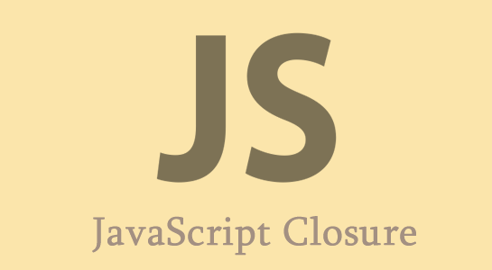

# Closure 란?

[Mozilla 재단](https://developer.mozilla.org/en-US/docs/Web/JavaScript/Closures)에서는 closure을 다음과 같이 정의합니다.

```
A closure is the combination of a function bundled 
together (enclosed) with references to its surrounding state 
(the lexical environment)
```

이를 한마디로 변역하면 다음과 같습니다.

*클로저는 함수와 함수가 선언된 렉시컬 스코프의 조합이다.*

저와 같이 클로저를 맛보기만 해온 사람이라면 클로저를 단지 그거 함수 리턴하는거 아니야? 라는 착각과 함께 분명 한글인데 무슨 소린지 하나도 모를 것입니다.

이 글에서는 클로저를 순한 맛 버전과 매운맛 버전 2가지 관점에서 다뤄 볼 것입니다.

<br> 

# Closure - 순한맛

*클로저는 함수와 함수가 선언된 렉시컬 스코프의 조합이다.*

이 문장을 누구나 알아 들을 수 있는 쉬운 말로 의역하자면 클로저는 `생성된 환경을 기억하는 함수`로 이해할 수 있습니다.

순한맛 버전은 사실 이게 끝입니다.

간단한 코드로 살펴보겠습니다.

```javascript
function foo () {
  var a = 1;
  function boo() {
    console.log(a);
  }
  
  return boo;
};

foo()()
```

여기서 `foo()`의 값은 zoo 함수입니다. zoo는 생성될 때 스코프 체인에 따라(스코프도 함수 선언시 생성되기 때문!) boo의 값을 알 수 있게 되고 그렇기 때문에 foo 함수가 끝난 이후에도 boo의 값을 활용할 수 있게 되는 것입니다.

여기서 우리가 신기하게 봐야할 점은 gc(Garbage Collector)의 동작 방식입니다. 
분명 foo는 사용이 끝났는데 gc가 청소를 하지 않고 있습니다.
이 부분은 다음 매운 맛 버전에서 진행하도록 하겠습니다.

<br>

# Closure - 매운맛

## Lexical Scope 란?

lexical scope 는 정적 스코프라고도 하며, 일반적이고 많은 프로그래밍 언어가 채택하고 있는 방식중 하나입니다.<br>
lexical scope 를 약간 어렵게 정의 하자면 렉싱타임에 정의 되는 스코프 입니다.<br>
이를 바꿔 말하면 렉시컬 스코프는 개발자가 코드를 짤 때 변수와 스코프 블록을 어디서 작성하는가에 기초해 렉서가 코드를 처리할 때 확정됩니다.
<br>
<br>
여기서 렉싱 타임이란 컴파일러에서의 렉싱을 의미합니다.<br>
렉싱이 뭔지 모르시는 분이라면 컴파일러는 코드를 tokenizing 후 lexing 처리하는데 잘라낸 토큰에 의미를 부여하는 것이 lexing 이라고 이해하시면 됩니다.

> ps : javascript는 이름에서도 script가 있고 일반적으로도 인터프리터로 분류하지만 사실은 컴파일 언어 입니다.

내용이 굉장히 어렵죠. 정리하자면 렉시컬 스코프를 다음과 같이 표현할 수 있습니다.

`개발자가 코드를 작성할 때 함수를 어디에 선언하는지에 따라 정의되는 스코프`

<br>

## Closure 의 모든 것

클로저는 자바스크립트의 모든 곳에서 존재합니다.
클로저는 렉시컬 스코프에 의존해 코드를 작성한 겨로가 그냥 발생하는 것입니다.

앞서 사용했던 예제 코드를 다시 한번 살펴보겠습니다.

```javascript
function foo () {
  var a = 1;
  function boo() {
    console.log(a);
  }
  
  return boo;
};

var baz = foo();

baz();
```

여기서 보면 함수 boo는 foo의 렉시컬 스코프에 접근 할 수 있고 그 함수 객체 자체가 foo의 리턴 값으로 반환됩니다.

그렇다면 여기서 baz는 boo 의 참조가 될 것이고 이를 실행시키게 된다면 결국은 boo가 실행되게 되는 것입니다.

이렇게 foo가 실행된 이후에도 boo는 foo의 렉시컬 스코프에 대한 참조를 가지고 있는데 이 참조를 `클로저`라고 부르는 것입니다.

<br>

여기서 주의를 기울여 볼 필요가 있는 방식은 앞서 간단히 언급한 javascript의 gc 동작 방식입니다.

클로저가 없는 언어라면 foo가 실행되고 더이상 사용되지 않는다면 foo의 내부 스코프는 gc가 메모리를 해제 시킬 것입니다.

하지만 javascript에서는 클로저가 해당 내부 스코프를 참조하고 있으므로 여전히 사용중인 영역이게 됩니다. 따라서 gc의 대상이 아니게 됩니다.

<br>

정리하자면 클로저는 javascript의 표준이고 함수를 값으로서 마음대로 넘길 수 있는 렉시컬 스코프 환경에서 코드를 작성하는 방법일 뿐입니다.

> ps : 이를 가능하게 하는 것은 javascript에서는 함수가 일급객체이기 때문입니다!

<br>

# Closure 활용 사례

closure을 활용하는 대표적인 사례 몇가지만 살펴 보겠습니다.

## 1. Private variable

Javacript에서는 본래 private이라는 개념이 없습니다.
private이 없는 이유는 Javascript에서는 원래(ES 6 이전) 클래스도 없었기 때문입니다.
그렇지만 우리는 많은 경우에 변수를 외부로부터 숨기고 싶은 욕구를 느낄 텐데 이때 closure을 이용하면 쉽게 private 변수를 만들 수 있습니다.

코드로 간단하게 살펴보면 다음과 같습니다.
카운트 하는 객체를 만들 것입니다.

```javascript
const counter = (init = 0) => {
  let count = init;
  return {
    getCount : () => count,
    addCount : () => ++count
  }
}
```

함수 외부에서는 count라는 변수가 있는지 알 도리가 없습니다. 오직 counter 함수가 제공하는 모듈의 getCount, addCount만 이용하여 count에 접근할 수 있게 됩니다.

## 2. Memoization

메모이제이션은 반복적으로 사용되는 결과를 메모리에 저장하여 사용함으로서 연산의 수를 줄이는 기법입니다.

메모이제이션의 예는 피보나치 수열이 가장 유명합니다.

```javascript
// 피보나치 수열을 재귀 함수로 계산하는 함수
var count = 0;
var fibonacci = function(number) {
    count ++;
    return number < 2 ? number : fibonacci(number - 1) + fibonacci(number - 2);
}

for(var i = 0; i <= 10; i++) {
    console.log(fibonacci(i)); // 0, 1, 1, 2, 3, 5, 8, 13, 21, 34, 55
}
console.log("count : " + count) // count : 453
```

단순 반복문 혹은 재귀를 이용하면 나는 앞서 9자리 까지의 피보나치 수를 구했어도 10을 구할려면 다시 처음부터 더해 와야 합니다.

이를 클로저를 이용한 메모이제이션을 활용하면 다음과 같이 연산량을 획기적으로 줄일 수 있습니다.

```javascript
var count = 0;
var fibonacci = function() {
    var memo = [0, 1];
    var fib = function(number) {
        count++;
        var result = memo[number];
        if(typeof result !== 'number') {
            result = fib(number - 1) + fib(number - 2);
            memo[number] = result; // 저장되지 않았던 피보나치 수를 memo 배열에 저장
        }
        return result;
    };
    return fib;
}();

for(var i = 0; i <= 10; i++) {
    console.log(fibonacci(i)); // 0, 1, 1, 2, 3, 5, 8, 13, 21, 34, 55
}
console.log("count : " + count) // count : 29
```

## 3. Curring

커링은 함수와 인수를 결합하여 새로운 함수를 만들 수 있게 하는 것 입니다.

다음과 같이 add 함수를 정의할 수 있습니다.

```javascript
function add(num1) {
  return function(num2) {
    return num1 + num2;
  }
}

const add10 = add(10);
const result = add10(20);
```

<br>

# Quiz

## 아래 코드의 출력 결과를 예상하고 그렇게 출력되는 이유를 설명해주세요.

```javascript
for(var i = 0; i < 5; i++) {
  setTimeout(()=>{
    console.log(i)
  }, 1000)
}
```

```javascript
for(var i = 0; i < 5; i++) {
  var j = i;
  setTimeout(()=>{
    console.log(j)
  }, 1000)
}
```
```javascript
for(var i = 0; i < 5; i++) {
    (function(){
        setTimeout(() => {
            console.log(i)
        }, 1000)
    })()
}
```

```javascript
for(var i = 0; i < 5; i++) {
    (function(){
        var j = i;
        setTimeout(() => {
            console.log(j)
        }, 1000)
    })()
}
```

```javascript
for(var i = 0; i < 5; i++) {
  (function(j) {
    setTimeout(()=>{
      console.log(j)
    }, 1000)
  })(i)
}
```

```javascript
for(let i = 0; i < 5; i++) {
  setTimeout(()=>{
    console.log(i)
  }, 1000)
}
```

<br>

<br>

> #### Reference
>
> - [You Don't Know JS](https://www.oreilly.com/library/view/you-dont-know/9781491924471/)
> - [WHAT IS CLOSURE IN JAVASCRIPT?](http://www.thecreativedev.com/what-is-closure-in-javascript/)
> - [[javascript]커링과 메모이제이션](https://hicoffee.tistory.com/60)
> - [함수의 범위(scope)](https://www.zerocho.com/category/JavaScript/post/5740531574288ebc5f2ba97e)
> - [메모이제이션 (Memoization)](https://frontsom.tistory.com/11)